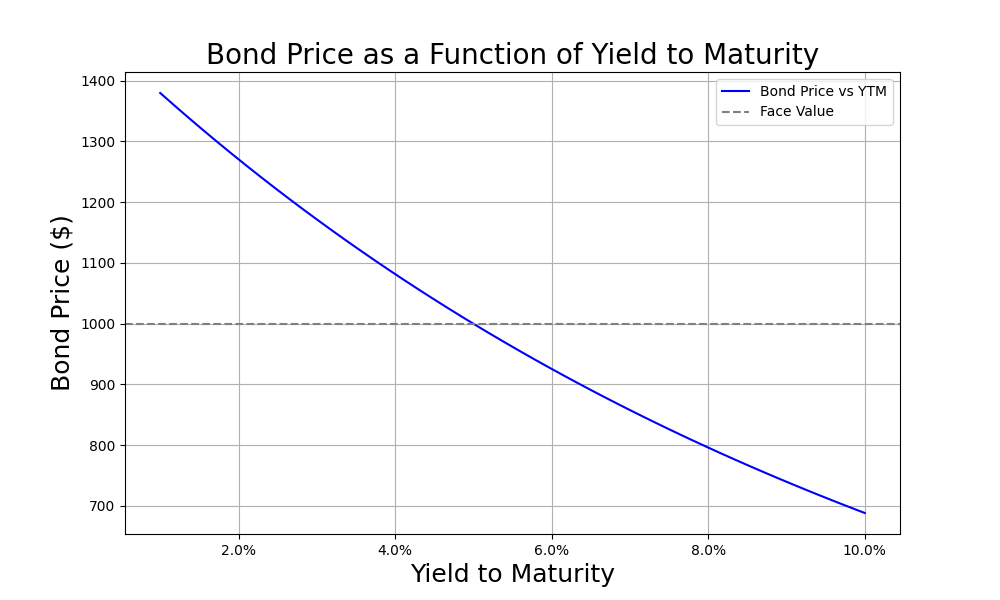

# Bond Pricing Tool

This project demonstrates how to calculate bond prices and visualize the relationship between bond price and yield to maturity (YTM).

## Files Included
1. `bond_pricing_tool.ipynb`: Interactive Jupyter Notebook with code, markdown explanations, and outputs.
2. `bond_pricing_tool.py`: Standalone Python script with the same functionality.
3. `price_vs_ytm.png`: Image of sample relationship between price and YTM.
4. `README.md`: Project description and usage instructions.
5. `LICENSE`: Standard MIT software license

## Requirements
- Python 3.x
- Libraries: `numpy`, `matplotlib`

## Usage
- Run the Jupyter Notebook (`.ipynb`) for an interactive experience.
- Alternatively, execute the Python script (`.py`) for quick calculations.
